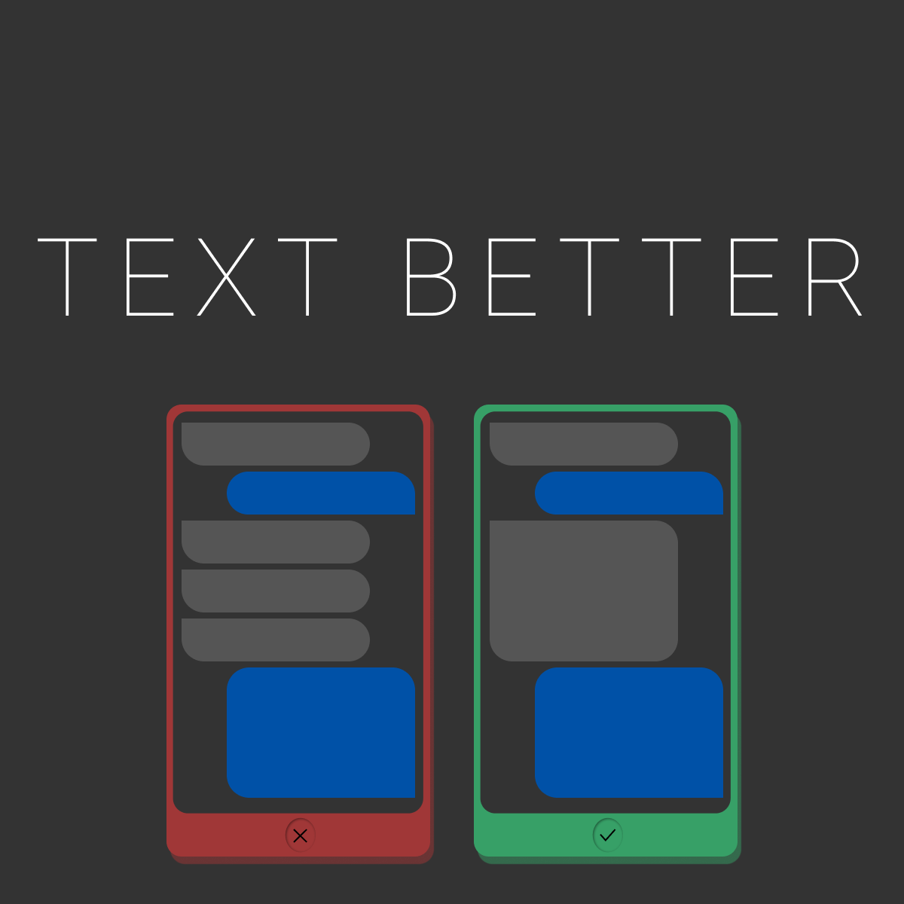

# Text Better

> WIP

Данный проект создан как попытка повысыть культуру общения в месенджерах.
Особенно в рабочей среде. Соблюдая простые правила, мы можем заметно улучшить
наше каждодневное общение - избежать раздражений и недопониманий, побуждать
сотрудничество и помощь, вместо пассивности и противодействия.

Если вы согласны с данными правилами, поделитесь ими с вашими знакомыми и коллегами.
А также не стесняйтесь предлагать ваши правила или исправления в Issues или Pull Request.

Данные правила не составлены на основании серьезных исследований, опросов или т.п.,
но основаны на коллективном опыте.

Они могут различаться для различных культур, порядков и компаний.

Используйте на свое усмотрение.
